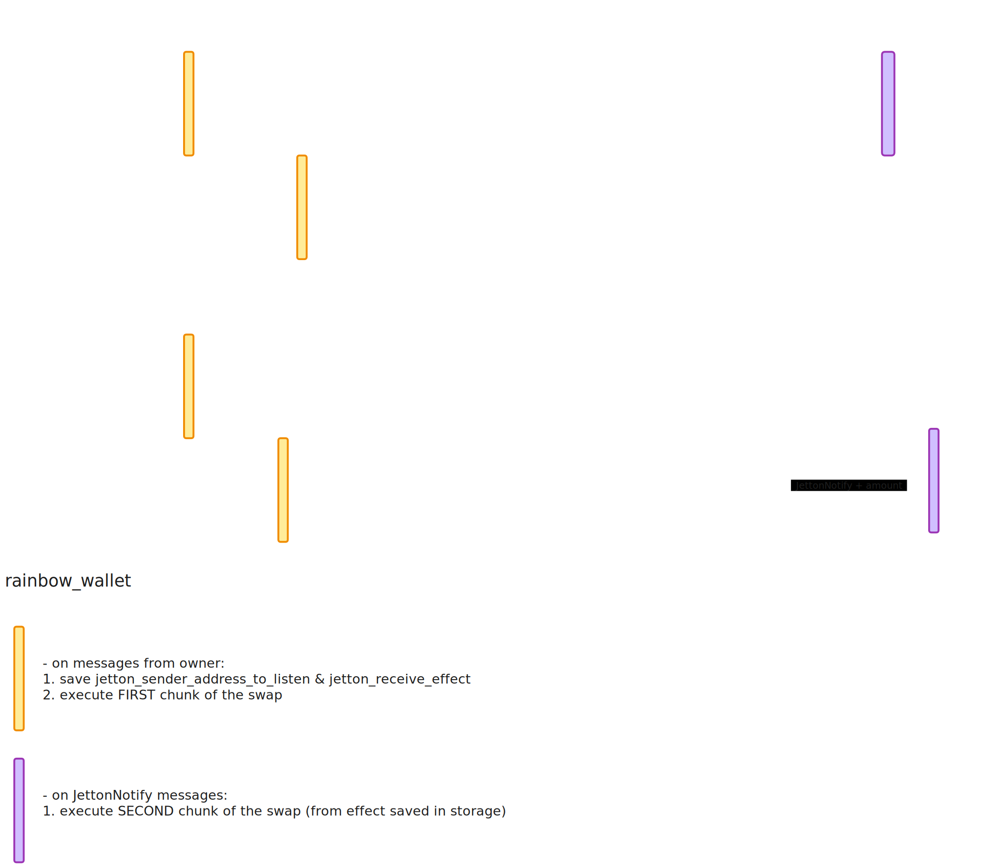

# Rainbow 🌈

An open source repository for the Rainbow Swap frontend interface and smart contracts maintained by [Blackbot](https://blackbot.technology/). Rainbow Swap is an aggregator on TON 💎.


### Interfaces

- TMA: [@rainbow_swap_bot](https://t.me/rainbow_swap_bot)
- Web: [rainbow.ag](https://rainbow.ag)

### Socials / Contact

- Telegram Channel: [@rainbow_swap](https://t.me/rainbow_swap)
- Community Chat: [@rainbow_swap_chat](https://t.me/rainbow_swap_chat)
- Email: [info.blackbot@gmail.com](mailto:info.blackbot@gmail.com)

### Problem

TON DEXes have fragmented liquidity, each with its own set of liquid tokens. As the TON ecosystem grows, this uneven distribution worsens, leading to inefficient trades and arbitrage opportunities. Users often lose money due to the high price impact when swapping tokens on a single DEX.

### Solution

Rainbow Swap aggregates liquidity from multiple TON DEXes, distributing trade volume across optimal routes to minimize price impact and slippage. This ensures users get the best possible prices in a single transaction.

### Examples


### Results

Our user-friendly interface allows seamless swaps with the most efficient routes, considering swap distribution and gas costs. Swap now with our bot [@rainbow_swap_bot](https://t.me/rainbow_swap_bot) and share your thoughts and suggestions in [Community Chat](https://t.me/rainbow_swap_chat)! 🌈🚀

# Development info

### Getting Started

1. Clone repository
```
git clone https://github.com/0xblackbot/rainbow-swap.git && cd rainbow-swap
```

2. Install dependencies
```
yarn
```

3. Start the development server
```
yarn start
```

[Instructions for running the development application as TMA](docs/TMA-development.md)

Before opening a pull request, ensure the code passes all pipeline checks. You can run:
```
yarn ts
yarn lint
```

### Smart contract

`Rainbow routing wallet` smart contract acts as a middleman, enabling seamless swaps between two different decentralized exchanges (DEXes) in a single transaction.  
To guard against asset loss (there have been no such cases yet), it also allows users to withdraw TON or jettons, similar to a Jetton Wallet contract.  

Events diagram:



Smart contracts are written using [FunC](https://docs.ton.org/develop/func/overview).  
All code can be found in the [contracts](contracts) folder.  

To build `Rainbow routing wallet` smart contract run
```
yarn build:contract
```

### License

This project is licensed under the Apache License 2.0 - see the [LICENSE](LICENSE) file for details.
